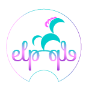
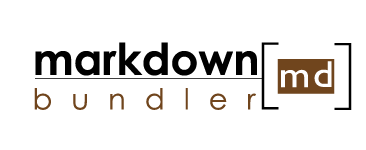
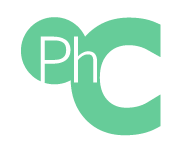
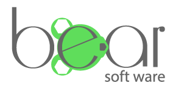

Не женат, детей не имею.
Возможна релокация.
График работы - гибкий, возможна как полная так и неполная удаленная занятость.

## Какую позицию я хотел бы занять в вашей компании.

Я хотел бы преумножить свой практический опыт полученный в своих и open-source проектах в ниже перечисленном стэке, и хотел бы зарекомендовать себя на позиции как опытный junior - без официального опыта работы и продвижением на позицию midle в вашей компании в течении полугода.

## Есть опыт по следующим позициям:
 * css ([scss](https://sass-lang.com/), [smacss](https://smacss.com/), [bootrap framework](https://v4-alpha.getbootstrap.com), [bootrap grid](https://www.w3schools.com/bootstrap/bootstrap_grid_system.asp) and [flexboxgrid](http://flexboxgrid.com/))
 * html ([pug/jade](https://pugjs.org/api/getting-started.html), [semantic layout](https://blogs.msdn.microsoft.com/jennifer/2011/08/01/html5-part-1-semantic-markup-and-page-layout/), [html5](https://www.w3schools.com/html/html5_intro.asp), experience of layout: 3 adaptive sites)
 * js ( [vueJs](https://vuejs.org/v2/guide/) - 1 project, [reactJs](https://reactjs.net/), [jsx](https://jsx.github.io/), [webpack](https://webpack.js.org), [rollup](https://github.com/rollup), [gulp](https://gulpjs.com/), core-js)
 * nodeJs ([ExpressJs](https://expressjs.com/), [KoaJs](https://koajs.com/), [Vuex](https://vuex.vuejs.org/ru/))
 * database ([mongoDb](https://www.mongodb.com/) - 1 project)
 * OS linux ( [bash](https://www.gnu.org/software/bash/), [lua](https://www.lua.org/))
 * project version ([GitHub](https://github.com), [GitBucket](https://bitbucket.org), [semantic version project](https://semver.org/))
 * tests (GUI-[selenium](https://www.seleniumhq.org)/[webdriver](http://webdriver.io/api.html), [jasmine](https://jasmine.github.io/), [jest](https://jestjs.io/), [TDD development](https://en.wikipedia.org/wiki/Test-driven_development))
 * UI/UX (I watched [course on UX / UI from Yandex school](https://www.youtube.com/watch?v=iqHWl06dSaE&list=PLRGs42pjA4ukpjurmwFzJfSCZcur01vki), studied and compiled a short visual aid-cheat sheet on [color theory and color schemes for non-designers.](Https://github.com/olegtempl/manual-color-scheme))
 * project management ([kandan](http://blog.crisp.se/mattiasskarin/files/pdf/10different_kanban_boards_and_their_context_mskarin.pdf)/[xp](https://tados.ru/wp-content/uploads/2017/04/%D0%91%D0%BE%D1%80%D0%B8%D1%81_%D0%92%D0%BE%D0%BB%D1%8C%D1%84%D1%81%D0%BE%D0%BD_%D0%93%D0%B8%D0%B1%D0%BA%D0%B8%D0%B5_%D0%BC%D0%B5%D1%82%D0%BE%D0%B4%D0%BE%D0%BB%D0%BE%D0%B3%D0%B8%D0%B8.pdf)/[scrum](http://scrum.org.ua/wp-content/uploads/ScrumAndKanbanRuFinal.pdf), (trello)[https://trello.com/])
 Я активно использую kandan доски в своих проектах и повседневной жизни и на основе накопленного опыта спроектировал сообственную методологию на основе xp, scrum и kanban.
 * md (There is a lot of experience in writing and preparing documentation for projects, I always write documentation for all my projects. this is an important aspect for easy entry into the project of new participants - which is especially important in open-source projects.)
 * I adhere to the style of writing code from AirBnb - to comply with the coding style I use:
   [eslintrc](https://eslint.org/)
   [prettier](https://github.com/prettier/prettier)
   [jsbeautifyrc](https://github.com/beautify-web/js-beautify)
   [editorconfig](https://editorconfig.org/)

## My online courses:

* [Code academy (Html, css)](https://www.codecademy.com/)
* [Bit degree (Web design)](https://www.bitdegree.org)
* [The Rolling Scopes School (Js-core)](https://school.rollingscopes.com)

## Список моих проектов:

 
 
 
 
 
 
[")](https://github.com/olegtempl/node-cl-log) 
 
 

<!--   -->
<!--   -->
<!--  -->
<!--  -->

## My contacts:

* phone number: 80259654011
* email: @bear-software.by
* github repository: https://github.com/olegtempl
* instagramm: oleg_templ
* linkedin: https://www.linkedin.com/in/oleg-medvedev-178279166/

Более подробную информацию о моих достижениях можно увидеть в сопроводительном письме или по [ссылке](http://bear-software.by/resume) 

----

## Сопроводительное письмо 

Спасибо за время, выделенное на прочтение резюме.

### Спортивные достижения 

Занимаюсь туризмом около 5 лет, из них 2 руководитель походов. Много путешествую автостопом.
Мне очень нравиться игра в шахматы, имею спортивное звание кандидат в мастера спорта, неоднократно становился победителем соревнований, был чемпионом своей страны. 

### Образование
#### МГК Електроники

 * **Название степени:** Среднее-специальное образование.
 * **Специализация specialty:** Мехатроник \ Наладчик технологического оборудования 
 * **Даты начала и окончания:**  2011 – 2015
 * **Работа по специальности:** По окончании учебного заведения присвоена квалификация: мехатроник 6-го разряда \ наладчик технологического оборудования 6-й категории.

#### Белорусский национальный технический университет

 * **Название степени:** Высшее образование.
 * **Специализация specialty:** Микро-нано технологии 
 * **Даты начала и окончания:** 2016 - 2020
 * **Работа по специальности:** Нанотехнологи создают новые материалы с чётко заданной атомарной структурой. К нанотехнологиям относят также разработку и создание электронных схем, основанных на элементах  размером с молекулу или атом. Разработку роботов (наномашин, нанороботов) размером с молекулу. А также методы исследования таких объектов.

Разделяю мнение [Вадима Семёновича Зицера](cyclowiki.org/wiki/Вадим_Семёнович_Зицер) на счет обучения молодежи и его целостную систему современной практики гуманистической педагогики (неформального образования — НО). Регулярно посещаю  митапы и конференции посвященные как front-end разработке и технологии blockchain. 

Вклад в opensource сообщество
Делаю вольные переводы документаций и статей на русский и беларуский языки. Есть ряд своих opensource проектов.

## Наиболее значимые Open-source projects in which I participated
 
* [Html css](https://github.com/diglabby/diglab_landing_page)
* [VueJs](https://github.com/diglabby/chat-widget-for-slack)

Подробную информацию о моих навыках можно увидеть в резюме. Буду рад предложению встретиться и рассказать о своем опыте, потенциале и навыках.

